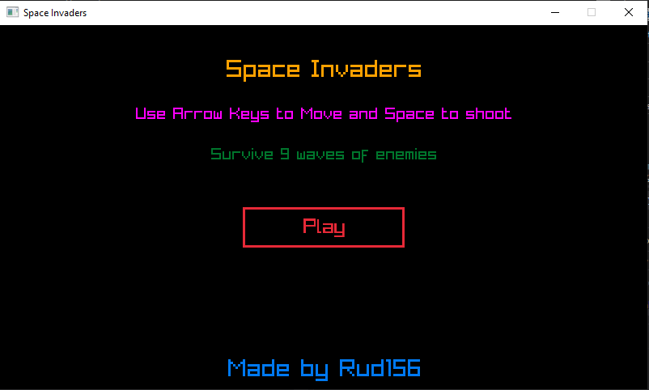
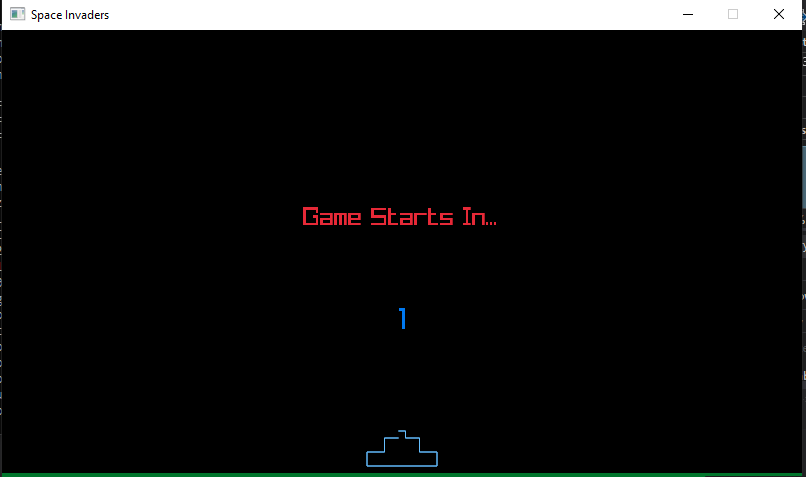
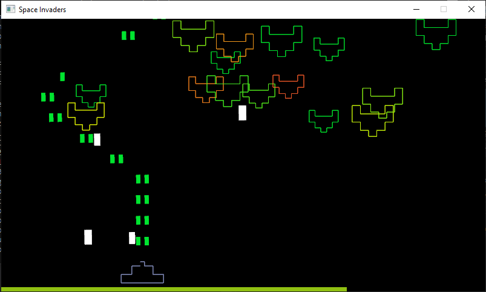
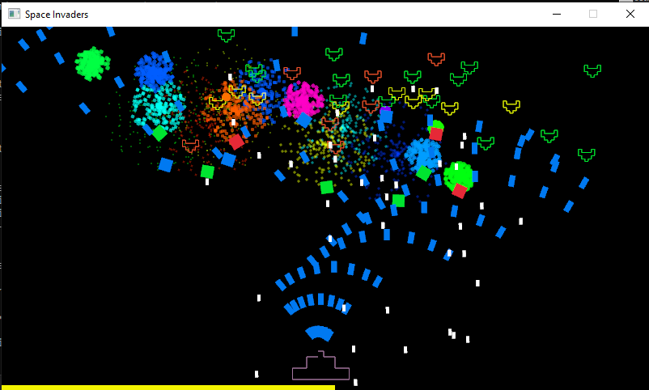
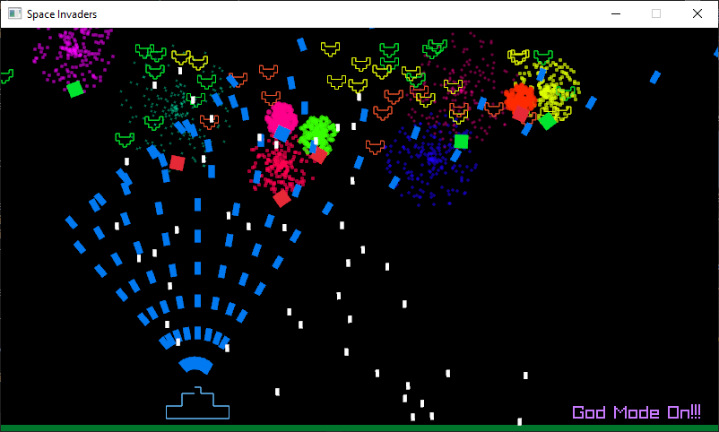
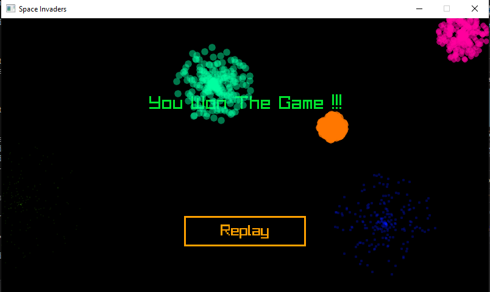

# SpaceInvaders
#### A simple space inavders clone made using RayLib in C++
> Find out more about RayLib [here](https://raylib.com/).

### Objective:
Destroy all enemies and survive for 9 waves.

### Controls:
- Use Left and Right Arrow Keys to move
- Press and hold Space to shoot

> Gameplay video can be found at https://github.com/Rud156/SpaceInvaders/tree/master/Video/Space%20Invaders.mp4

### ScreenShots:

